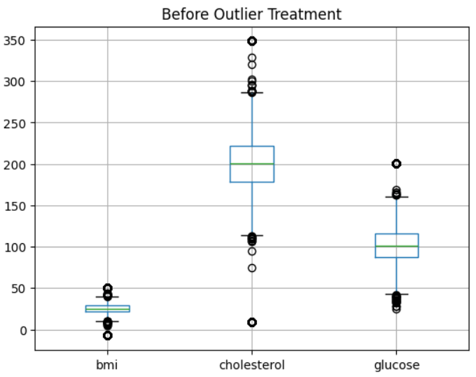

# 🏥 Patient Health Data Analysis & Preprocessing Project

🚀 This project demonstrates complete **data preprocessing pipeline** on a synthetic healthcare dataset, including:
- Missing Value Handling
- Outlier Detection & Treatment
- Final Clean Dataset Preparation

The cleaned dataset is optimized for **Machine Learning models** to predict patient disease risk.

---

## 📌 📂 Dataset Overview

| Feature | Description |
|--------|------------|
| patient_id | Unique patient identifier |
| age | Age of patient |
| gender | Male / Female |
| region | North / South / East / West |
| bmi | Body Mass Index |
| blood_pressure | Systolic BP (mmHg) |
| cholesterol | Cholesterol level |
| glucose | Blood glucose level |
| disease_risk | Target (0 = Low, 1 = High) |

📊 Total Records: **9000**

---

## 🔗 📥 Dataset Access

- [patient_health_records.csv](patient_health_records.csv)

---

## 🧪 ⚙️ Project Workflow

### 🔹 1. Missing Value Handling
✔ Applied multiple techniques:
- Mean & Median Imputation  
- Most Frequent Imputation  
- Missing Indicator + Random Sampling  
- KNN Imputer  
- MICE Algorithm  

📌 **Best Choice:**
- Median (for BMI)
- MICE (for numerical features)
- Mode (for categorical)

---

### 🔹 2. Outlier Detection & Treatment

✔ Methods Used:
- Z-score (Aggressive removal)
- IQR (Balanced removal)
- Percentile Capping
- Winsorization (Best for preserving data)

📌 **Final Strategy:**
- BMI → IQR  
- Cholesterol & Glucose → Winsorization  

---

### 🔹 3. Data Visualization

- Boxplot (Before vs After Cleaning)

---

## 🖼️ 📸 Project Preview

---

## 🧹 ✅ Final Clean Dataset

✔ No Missing Values  
✔ Outliers Handled Properly  
✔ Balanced & Consistent Data  

📊 Final dataset is:
- Clean
- Reliable
- Ready for ML models

---

## 📊 📄 Automated Report

Generated using **ydata-profiling**:

✔ Missing Value Analysis  
✔ Feature Distribution  
✔ Correlation Matrix  
✔ Outlier Insights  

---

## 📈 📉 Results & Insights

| Method | Performance |
|------|------------|
| Z-score | Too aggressive ❌ |
| IQR | Balanced ✔ |
| Winsorization | Best ✔✔ |

---

## 🚀 💡 Key Learnings

- Different columns require different cleaning strategies  
- Over-cleaning (Z-score) can remove valuable data  
- Winsorization is best when data retention is important  
- Data preprocessing directly impacts model performance  

---

## 👩‍💻 Author

**Janki Dholariya**  
